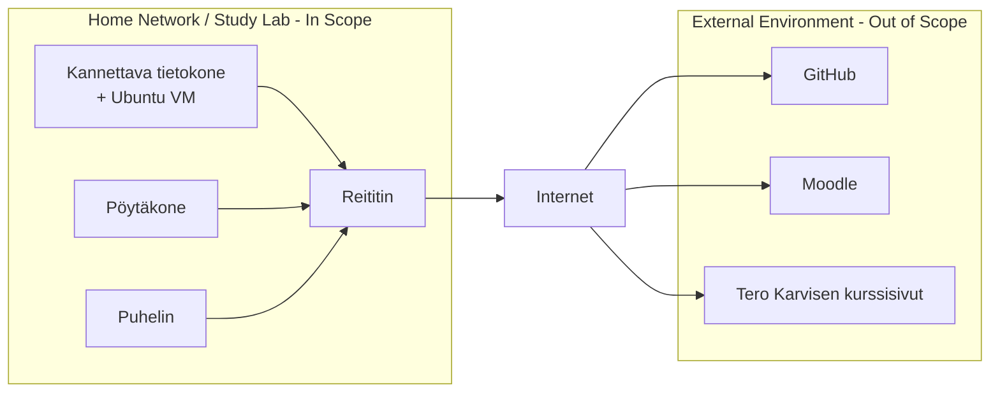
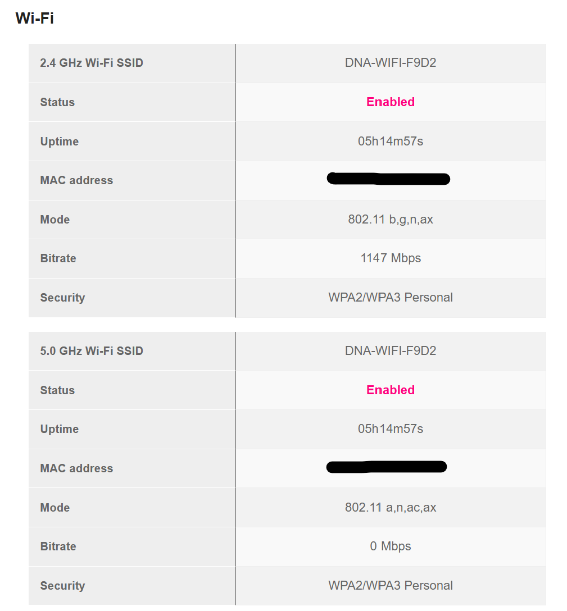
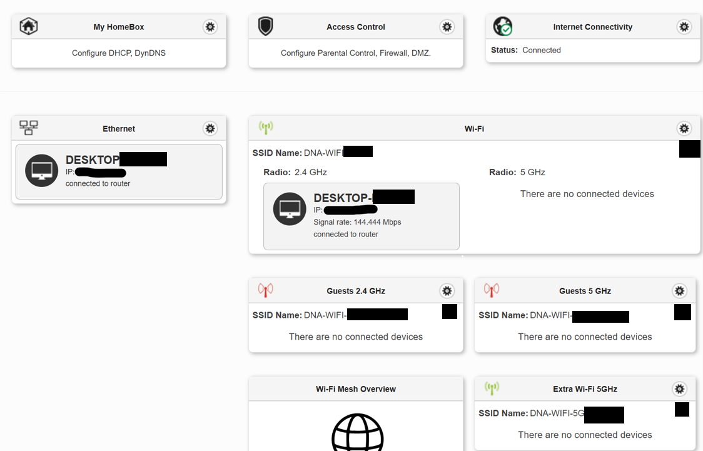
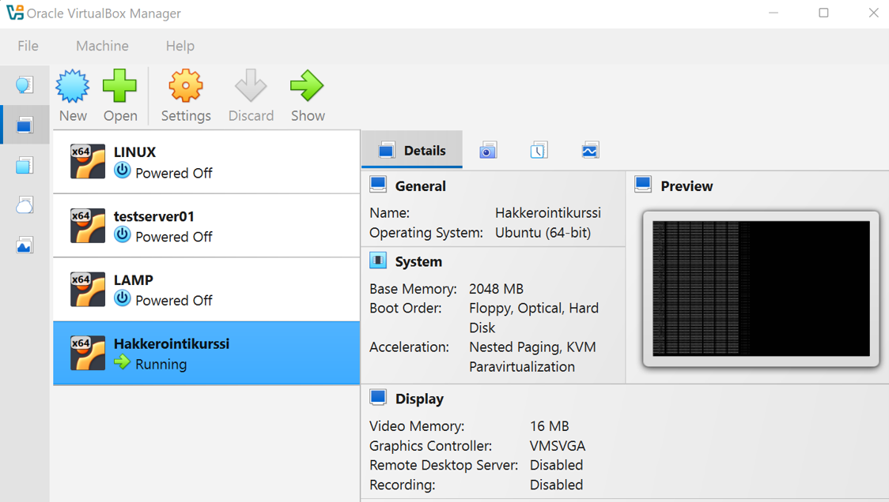

# H1

### a1) Soveltamisala

Kotiverkon sisäinen laitteisto:

o Sagemcom reititinmodeemi, 5G sekä 2,4G Wifiyhteys, jotka on suojattu salasanalla.

o Lenovo Thinkpad T470p, kannettava tietokone. 5G-Wifi-yhteydellä kotiverkossa, suojaustyyppi on WPA2. Käyttöjärjestelmä on Windows 11 Pro. Tämä on pääasiallinen laite kurssin tehtävien suorittamiseen.

o Kannettavalla tietokoneella on virtuaalisia Ubuntu-palvelimia, jotka pyörivät Oracle Virtual Box -sovelluksella. Yksi virtuaalipalvelin on käytössä kurssin tehtäviä varten.

o Pöytätietokone, eri valmistajien osista koottu. Ethernet-kaapelilla kiinni reitittimessä. Käyttöjärjestelmä Windows 10.

o Motorola Edge 50 Neo matkapuhelin, 5G-Wifi-yhteydellä kotiverkossa, suojaustyyppi on WPA3. Laite on tehtävien aikana käytössä vain monivaiheisessa autentikoinnissa, jota tarvitsee välillä pilvipalveluja, kuten Githubia ja OneDriveä käyttäessä.

Tehtävien apuna on kurssin opetusmateriaali, joka on sekä Moodle-verkkoympäristössä sekä ladattuna sieltä kannettavan tietokoneen paikalliselle kovalevylle. Muita verkkolähteitä myös käytetään, sekä tarvittaessa kielimallitekoälyä, kuten Chat GPT:tä. Tehtävävastaukset sekä kurssiin liittyvät henkilökohtaiset muistiinpanot tallennan Lenovo-tietokoneen sisäiselle kovalevylle, ja valmiit raportit tallennan lopulta kurssin tehtäviä varten tekemääni Github-repositorioon.

### a2) Soveltamisalan ulkopuolinen alue

o Soveltamisalaan ei kuulu reitittimen ulkopuolella oleva internet-palveluntarjoajan verkko, koska en voi vastata sen hallinnasta tai tietoturvasta.

o Puhelimesta kuuluu soveltamisalaan vain autentikointi-osa, eli Authenticator sovellus. Muu ei ole olennaista kurssin kannalta.

o Pilvipalvelut, joita en kurssilla käytä, rajaan pois soveltamisalueesta. Näitä ovat OneDrive sekä Google Drive. Rajaan ne pois soveltamisalan hallittavuuden selkeyttämisen vuoksi.

o Verkkorajapinnoista rajaan kaikki ne osat pois, mistä en voi mitenkään vastata, kuten verkkosovellusten infrastruktuurista.

### a3) Keskeiset rajapinnat ja rajat

Käytän Github-pilvipalvelua, jonne olen tehnyt kurssia varten oman repositorion, ja tänne tallennan valmiit tehtäväraportit. Haaga-helian opeturverkkoympäristö Moodle on toinen tärkeä rajapinta, koska sieltä pääsen käsiksi muun muassa kurssin opetusmateriaaliin ja tiedotteisiin. Verkkosovellus terokarvinen.com on erittäin olennainen rajapinta, sillä tehtävänannot ja tehtävien palautukset tehdään siellä.

Virtuaalisella Linux-palvelimella on asennettuna SSH, jolla järjestelmän etäkäyttö on mahdollista. VPN-tai RDP-yhteyksiä ei ole käsitykseni mukaan käytössä verkkoympäristössä kurssin aikana. Ympäristön raja on reitittimen palomuuri, jonka ulkopuolinen verkko ei kuuluu soveltamisalaan, lukuunottamatta verkkolähteiden materiaaleja ja repositoriota, joita käsittelen kurssilla.

Internetin palveluntarjoajani on DNA, ja reitittimen valmistaja on Sagemcom. Läppärin laitevalmistaja on Lenovo, ja puhelimen Motorola. Android-käyttöjärjestelmän kehittäjä on Google, ja Windowsin Microsoft. Pilvipalvelujen tarjoajia ovat Github ja Moodle.

Kaavio soveltamisalueesta ja ulkopuolisesta alueesta sekä rajapinnoista

### What evidence could I present?

Kuvakaappaus reitittimen infosivusta. Se näyttää olennaiset tiedot laitteesta, sensitiiviset tiedot on peitetty.

Kuvakaappaus reitittimen määrityssivulta (configuration page). Kuvassa näkyy, että pöytätietokone on yhdistetty Ethernet kaapelilla, ja läppäri on Wifi-yhteydessä reittitimeen. Kännykä ei jostain syystä näy sivulla.

Kuvakaappaus Oracle VirtualBox -sovelluksesta, jossa näkyy neljä virtuaalikonetta. Näistä vähintään alin, eli "Hakkerointikurssi", on aktiivisesti käytössä kurssilla.

https://github.com/tuomasvesa/hacking-course

Linkki Github-repositorioon, jonne tallennan valmiit tehtäväraportit. Repositoriossa tulee olemaan kansiot jokaiselle tehtävälle, nimillä h1, h2, ja niin edelleen.

## b)

| Kiinnostunut taho |                                   Tarve tai vaatimus                                   |  Vaatimusalue |                                                                Kuinka vaatimusta noudatetaan |
| :---------------- | :------------------------------------------------------------------------------------: | ------------: | -------------------------------------------------------------------------------------------: |
| Minä              | Kurssin tehtävien suoritus, henkilökohtaisten tietojen tietoturvallisuuden edistäminen |     Johtajuus |       Aktiviinen tehtävien suorittaminen ja opiskelu, ja tietoturvakäytäntöjen noudattaminen |
| Github            |                               Käyttäjätilin turvallisuus                               | Tukitoiminnot | Vahva tunnistautuminen, vain raporttien ja näihin liittyvien kuvien lisääminen repositorioon |
| Haaga-Helia       |            Hakkerointitehtävät tulee suorittaa vain sallittuihinkohteisiin             |      Toiminta |               Ohjeiden tarkka seuraaminen, ja tehtävien tekeminen määritellyssä kotiverkossa |

Käytin tehtävissä Chat-GPT:tä kaavion sekä taulukon muotoiluun Markdownissa, sekä reitittimen määrityssivulle pääsyssä ohjeistajana.

## Lähteet

Suomen standarisoimisliitto SFS ry. 2023. Tietoturvallisuus, kyberturvallisuus ja tietosuoja.
Tietoturvallisuuden hallintajärjestelmät. Vaatimukset (ISO/IEC 27001:2023).

OpenAI. 2026. ChatGPT-5.6 Luna. https://chatgpt.com/
