# H2

### x)

- Rikkinäinen pääsynhallinta (Broken Access Control) tarkoittaa käyttäjien pääsyä tietoon tai toimintoihin, joihin heillä ei pitäisi olla pääsyä (OWASP n.d.).

- Pääsynhallintatestit tulisi tehdä palvelimen puolella, kirjata aina niiden epäonnistuessa, ja testata oikeaoppisilla turvallisuustesteillä (OWASP n.d.).

- ffuf on verkkofuzzer, jolla voi löytää piilotettuja hakemistoja helposti (Karvinen 2023).

- ffuf sisältää suodatusvaihtoehtoja (jotka saa näkyviin komennolla ./fuff |& less), joilla voi suodattaa tuloksia mm. HTTP-statuksen tai vastauksen tavukoon perusteella. (Karvinen 2023)

- Vertikaalinen pääsynhallinta on joukko mekanismeja, joilla rajoitetaan tietyn tyyppisten käyttäjien toimintoja. Horisontaalinen pääsynhallinta rajoittaa tiettjen käyttäjien pääsyä resursseihin. (PortSwigger n.d.).

- Jos ohjelmistossa on haavoittuvuuksia, käyttäjä saattaa pystyä tekemään ns. luvattomia toimintoja muuttamalla selaimen pyynnön parametreja. Sensitiivistä dataa saattaa löytyä myös HTTP-pyynnön vastauksesta. (PortSwigger n.d.)

- Hyvä yleissääntö pääsynhallinnan haavoittuvuuksien estämiseksi ovat kieltää oletusasetuksena pääsy toimintoihin tai resursseihin elleivät ne ole julkisia (PortSwigger n.d.).

- Raportin tulee olla toistettava, eli lukijan tulee pystyä toistamaan työvaiheet ja pääsemään samassa raportoidussa ympäristössä samaan tulokseen. (Karvinen 2006).

- Täsmällisyys; jokainen toiminto, kuten komento, tulee raportoida, ja kellonaikojen kirjaaminen selkeyttää tehtävien vaiheisiin kulunutta aikaa. Onnistumisista ja epäonnistumisista sekä vikailmoituksista tulee raportoida selkeästi. (Karvinen 2006).

- Väliotsikointi, hyvä kielioppi, sopiva tekstimäärä sekä tiivistelmä parantavat raportin helppolukuisuutta ja tuovat ammattimaista uskottavuutta. Lähdeviittaukset kuuluvat olennaisiin akateemisiin standardeihin. (Karvinen 2006).

- Pahoja rikkeitä raportissa ovat muun muassa valheellinen sepittäminen, plagiointi ja kuvien luvaton kopiointi (Karvinen 2006).

## Ympäristö

Ympäristönä on Debian 13 käyttöjärjestelmä, joka pyörii Oracle Virtual Boxin kautta. Isäntälaite on Lenovo Thinkpad T470p, jonka käyttöjärjestelmänä Windows 11 Pro. Selain Debian-virtuaaliympäristössä on Firefox 140.12.0 (64bit). Verkkoasetuksena on NAT.

Debian-virtuaalikoneen tarkempia tietoja:

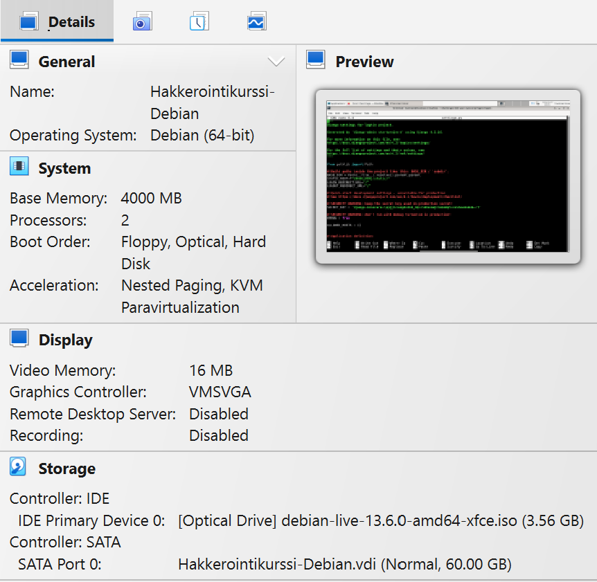

### a) Staff Only

Suoritin tehtävänannossa vaaditut asennukset ennen tehtävän aloittamista.

Testasin aluksi, että sivulla lukeva oma pinkoodini toimii. Kirjoitin hakukenttään 123, painoin 'Reveal my password' painiketta, ja ohjelma kertoi salasanani olevan 'Somedude', kuten kuuluikin. Kokeilin myös kokeilun vuoksi kirjoittaa kenttään tekstiä, mutta syöttökenttä ei hyväksynyt sitä.

Tehtävänto kertoi, että adminin salasana sisältää merkkijonon "SUPERADMIN". En ollut aluksi varma, pitääkö SQL injektio tehdä pin-koodin syötteen vai selaimen osoitekentän kautta, lähdin hakuammunta-tyyliin kokeilemaan jälkimmäistä. Mietin, että tässä voisi käyttää SQL:n LIKE operaattoria. Minun piti kuitenkin virkistää muistiani, kuinka tätä tarkalleen käytetään, joten googletin 'SQL Like', ja löysin heti W3Schoolin (n.d.) tutoriaalin. Kokeilin, tapahtuuko mitään, jos kirjoitan SQL-kyselyn suoraan URL:ään, jolloin polku oli http://127.0.0.1:5000/SELECT password from pins WHERE password LIKE '%SUPERADMIN%'. Tämä ei toiminut, ja palautti statuksen 404 Not Found.

Avasin vihjeet päästäkseni tehtävässä eteenpäin. Siellä oli neuvo elementtivalitsimen käytöstä (Ctrl-Shift-C), ja lokaalin DOM-puun muokkaamisesta Inspectorissa. Valitsin pin-koodin syöttökentän, ja päättelin, että 'input type' pitää luultavasti vaihtaa numerosta merkkijonoksi, jotta kenttään voi kirjoittaa SQL-injektion.

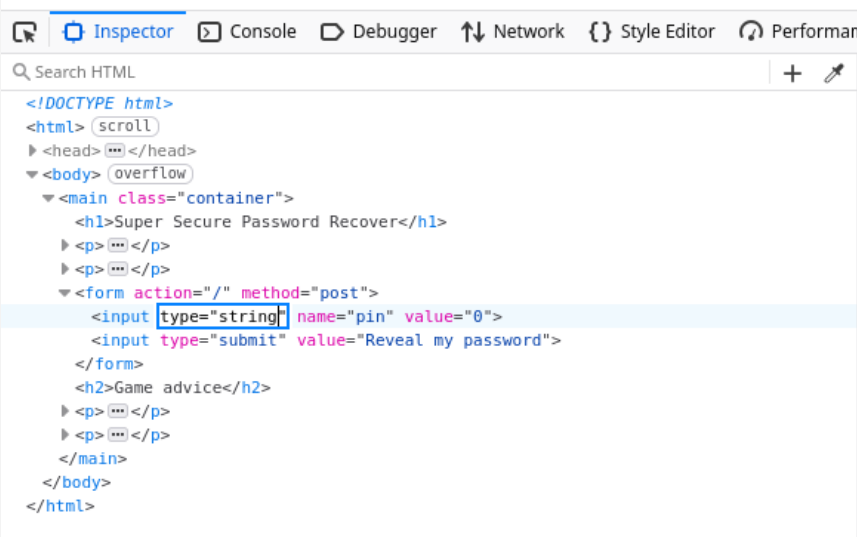

Muistelin oppitunnilla 27.8.2026 opittua SQL-injektiotapaa, jossa kirjoitettiin ' OR 1=1;--. Tämän merkkijonon syötettyäni ohjelma palautti salasanan 'foo'. Nyt olin siis askeleen lähempänä ratkaisua. Ilmeisesti "foo"-salasana on tietokannassa ensimmäisenä, ja ehdon ollessa TRUE ohjelma palauttaa ensimmäisen tuloksen. Mietin, että ehkä nyt voin hyödyntää LIKE-operaattoria. Kirjoitin seuraavan SQL-injektiolauseen:

'OR passoword LIKE '%SUPERADMIN&';--

Onnistui! Ohjelma palautti adminin salasanan.

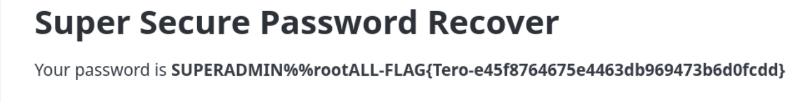

### b) Staff Only Fix

Haavoittuvuus oli mitä ilmeisimmin se, että ohjelman koodi ei tarkista, onko käyttäjän syöttämä arvo numero, ennen kuin käyttää tätä tietokantakyselyssä. Avasin kooditiedoston komennolla nano staff-only.py. Huomasin, että pin-koodisyötteestä tosiaankin muodostetaan merkkijonomuuttuja ilman mitään tarkistusta.

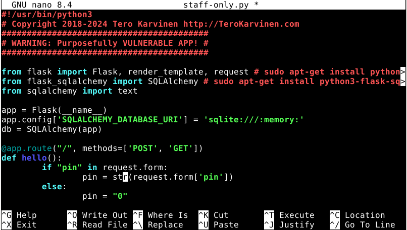

Lisäsin koodirivejä, joissa yritetään luoda pinistä integer try-catch lauseen sisällä, ja jos tämä ei onnistu, palautetaan virheviesti. Tämän pitäisi varmistaa, etteivät merkkijonosyötteet pääse läpi.

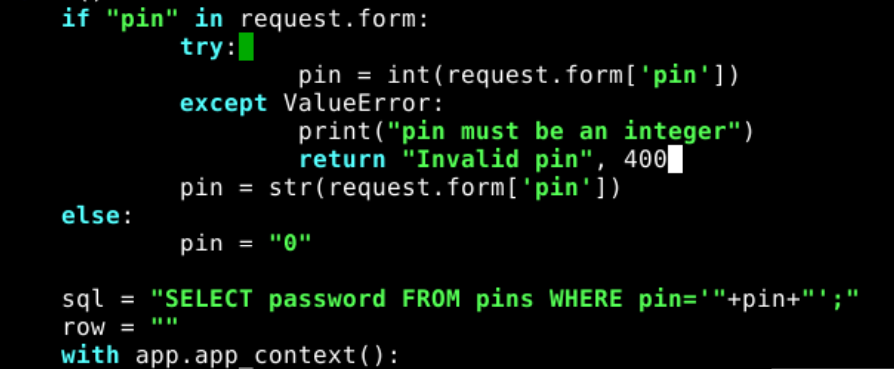

Tallensin ja suljin tiedoston, ja käynnistin ohjelman komennolla python3 staff-only.py. Testasin taas lausetta ' OR 1=1;-- pin-koodin syöttökenttään. Tulos oli halutunlainen, käyttäjä viedään sivulle jossa lukee "Invalid pin".

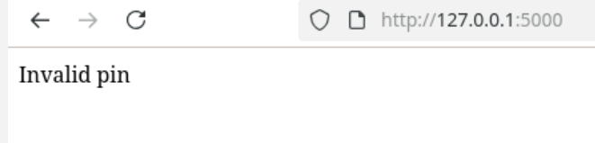

Tämä ei ehkä ole tyylikkäin tai käytännöllisin ratkaisu, mutta ainakin se toimi. Varmistin myös, että sääntöjenmukaiset syötteet toimivat edelleen odotetusti, eli kun syötin pin-koodin 123, ohjelma toimi normaalisti.

### c) Dirfuzt-1

Aloitin tehtävän toistamalla dirfuzt-0 esimerkin vaiheita, mutta tekemällä nämä uudelle tiedostolle. Suoritin komennot:

- wget https://terokarvinen.com/2023/fuzz-urls-find-hidden-directories/dirfuzt-1
- chmod u+x dirfuzt-1
- ./dirfuzt-1

Sovellus oli nyt siis käynnissä, ja avasin toisen terminaalin, jotta pystyin suorittamaan komentoja. Suoritin komennon ./ffuf -w common.txt -u http://127.0.0.2:8000/FUZZ jolla näin suuren määrän vastauksia tuhansista verkkopyynnöistä.

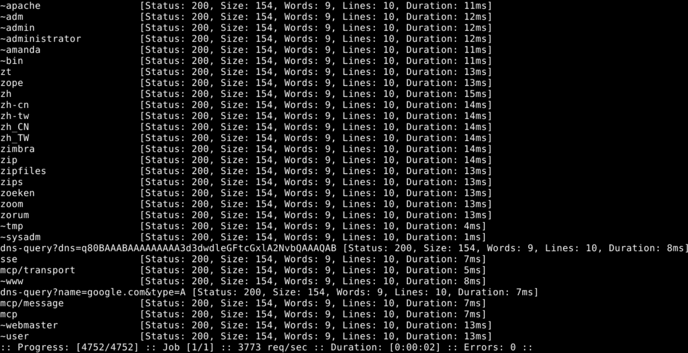

Valtaosa vastausten statuksista oli 200, koko 154 tavua, ja sanoja oli 9. Tuntui siis loogiselta suodattaa vastauksista kaikki 154 tavun suuruiset vastaukset komennolla: ./ffuf -w common.txt -u http://127.0.0.2:8000/FUZZ -fs 154

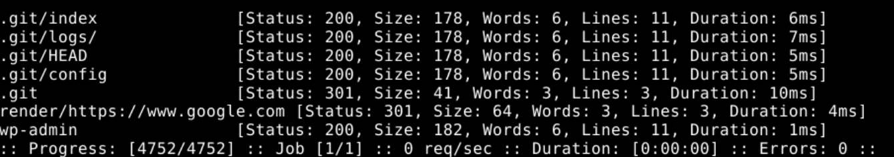

Tuloksista ylin, eli .git, vaikutti versionhallintasivuun osuvalta, joten kokeilin sitä selaimen osoitekentässä. Toimi!

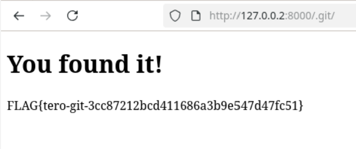

'wp-admin' oli puolestaan admin-sivun avaava sana.

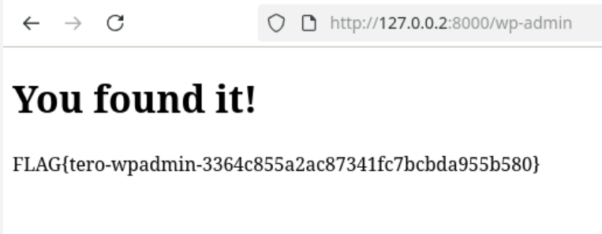

### d) Your Eyes only

Tehtävän alussa päätin yrittää ratkaista sen omin avuin, tai vähintään yrittää ennen ffuf:in käyttämistä. Aloitin tekemällä käyttäjän palveluun. Painoin "Register"-nappia sivun oikeassa yläkulmassa, tein käyttäjänimen ja salasanan, vahvistin nämä, ja minut ohjattiin kirjautumissivulle josta kirjauduin sisään käyttäjämällä juuri tekemiäni tunnuksia. Painoin "Show Personal Data" nappia, joka vei minut sivulle jossa listattiin "minun" harrastukset, lempilelut/keräilyasiat, ja hallussa olevat ohjelmointikielet. Nämä tiedot eivät vaikuttaneet ainakaan toistaiseksi hyödyllisiltä, joten palasin etusivulle.

Etusivulla painoin punaista "Admin Dashboard" -nappia, joka vei minut sivulle, jossa oli virheviesti 403 Forbidden. Palasin takaisin etusivulle, ja pohdin hetken seuraavaa askelta, mutta heikoin tuloksin. Painoin kuitenkin taas Admin Dashboard nappia katsoakseni mihin URL-osoitteeseen se vie. Osoite oli http://127.0.0.1:8000/admin-dasboard/. Mietin, että tehtävässä piti päästä hallintakonsoliin (administrative console), ja URL:ssä luki admin-dashboard. Päätin kokeilla asiaa, joka tuntui hieman hölmöltä, ja korvata osoitteesta dashboard -sanan console -sanalla. Se kuitenkin toimi! Pääsin "Admin secret page" -sivulle. Testasin tätä myös ulos kirjautumisen jälkeen, mutta silloin se ei siis toiminut. Kuka tahansa kirjautunut käyttäjä pääsee siis admin-konsolisivulle.

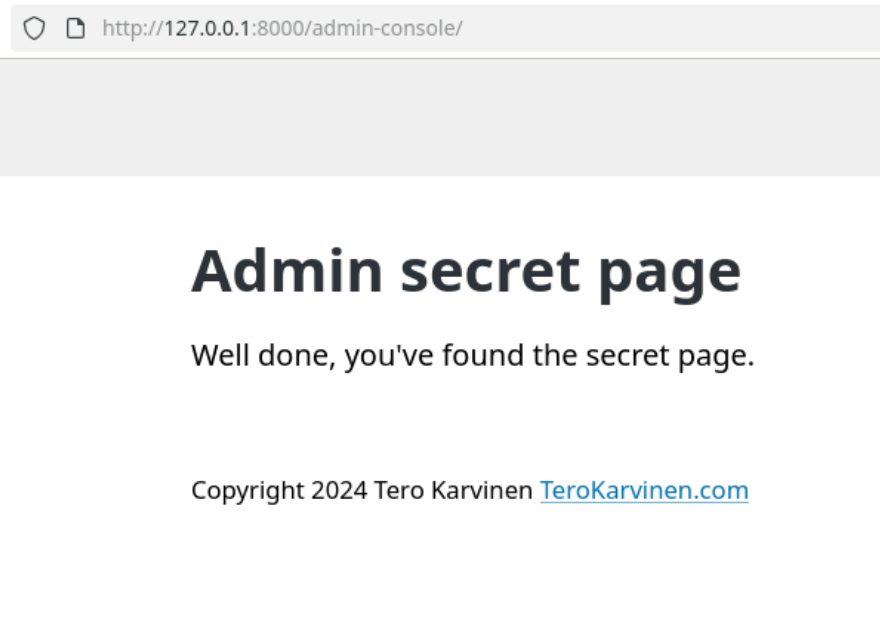

Tämän ratkaisun jälkeen myös huomasin, että kun osoitekenttään lisäsi juuriosoitteen jälkeen mitä tahansa tekstiä, joka ei muodosta validia URL-osoitetta, 404-sivu näyttää kaikki validit osoittet. Tämäkin tuntui tietoturvahaavoittuvuudelta. Sivulla kuitenkin lukee, että tämän voi korjata muuttamalla Django-asetustiedostosta DEBUG-muuttujan arvoksi False.

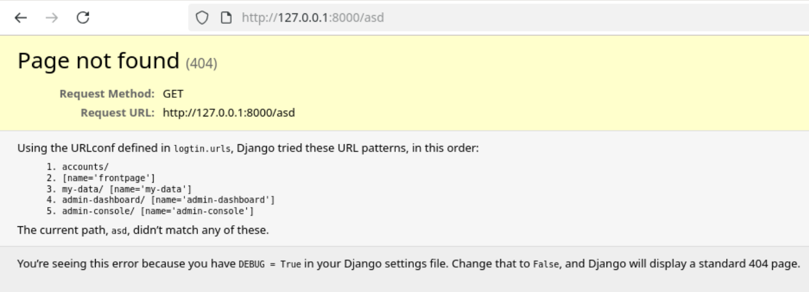

Päätin etsiä ratkaisua, jolla estäisi tavallisen käyttäjän pääsyn konsolisivulle. Selasin tehtävän hakemistorakennetta ja katsoin tiedostoja, mutta en löytänyt paikkaa johon korjaus olisi kuulunut tehdä. Katsoin sitten vinkin tehtävännon alta, jossa kerrottiin katselulupien tarkistusten olevan views.py -tiedostossa. Se löytyi hats-hakemistosta. Avasin tiedoston komennolla nano views.py, ja aikani tiedostoa tuijotettuani hoksasin, mikä siinä ehkä on vialla. AdminShowAllView-luokan test-func-funktiossa kuuluisi luultavasti olla 'self.request.user.is_staff' tarkistus, koska se on toisen luokan, AdminDashBoardViewin vastaavanlaisessa funktiossa. Lisäsin siis tiedostoon tämän koodinpätkän.

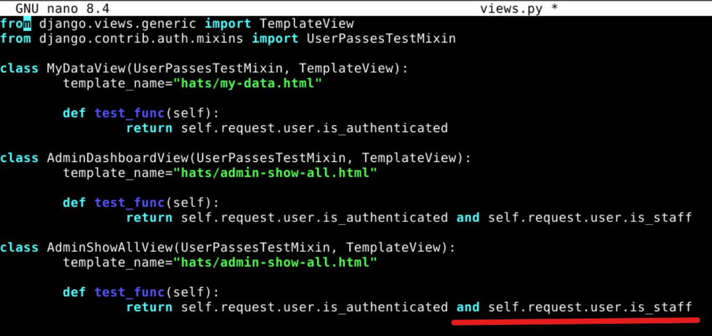

Testasin taas admin-console -sivulle siirtymistä, mutta tällä kertaa se ei onnistunut, joten ratkaisu toimi.

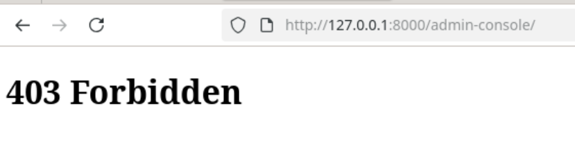

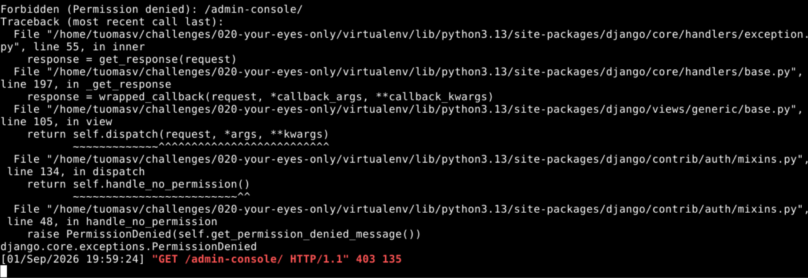

Yritin myös vaihtaa DEBUG-asetuksen. Muistin, että Linuxissa on olemassa komento, jolla löytää tiedostot, jotka sisältävät tietyn merkkijonon. Googletin "linux command for finding file with a string", ja menin LinuxJournal-sivuille. Sieltä poimin grep-komennon.

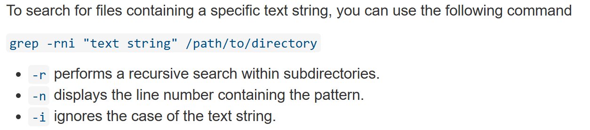
(Whittaker 2023)

Suoritin komennon grep -rni "DEBUG" hakemistossa /challenges/020-your-eyes-only/logtin. Komento palautti valtavasti tekstiä, joten ehkä olisin voinut tarkentaa sitä vielä. Vastauksen alussa oli kuitenkin tarvittava tieto, eli asetus löytyi tiedostosta /logtin/settings.py riviltä 28. Siirryin hakemistoon cd logtin -komennolla, ja avasin asetustiedoston komennolla nano settings.py. Muutin True-arvon False-arvoksi, ja tallensin ja suljin tiedoston. Koitin käynnistää sovelluksen uudelleen, mutta sain virheviestin.

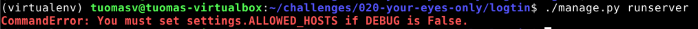

Vaikka olisin halunnut ratkaista tämänkin haasteen, tässä vaiheessa tehtävän tekemiselle jättämäni aika alkoi loppua, enkä siksi selvittänyt tätä asiaa loppuun asti. Mutta ehkei tämä ollut niin olennainen tehtävän kannalta.

## Lähteet:

Karvinen, T. 2023. Find Hidden Web Directories - Fuzz URLs with ffuf. Luettavissa: https://terokarvinen.com/2023/fuzz-urls-find-hidden-directories/. Luettu: 1.9.2026.

Karvinen, T. n.d.. Hack'n Fix. Luettavissa: https://terokarvinen.com/hack-n-fix/. Luettu: 1.9.2026.

Karvinen, T. 2006. Raportin kirjoittaminen. Luettavissa: https://terokarvinen.com/2006/raportin-kirjoittaminen-4/. Luettu: 31.8.2026.

OWASP s.a. A01:2021 – Broken Access Control. OWASP Top 10:2021. Luettavissa: https://owasp.org/Top10/2021/A01_2021-Broken_Access_Control/index.html. Luettu: 30.8.2026.

PortSwigger s.a. Access control vulnerabilities and privilege escalation. Web Security Academy. Luettavissa: https://portswigger.net/web-security/access-control. Luettu: 30.8.2026.

W3Schools s.a. SQL LIKE Operator. Luettavissa: https://www.w3schools.com/SQl/sql_like.asp. Luettu: 1.9.2026.

Whittaker, G. 2023. How to Search and Find Files for Text Strings in Linux. Linux Journal. Luettavissa: https://www.linuxjournal.com/content/how-search-and-find-files-text-strings-linux. Luettu: 1.9.2026.
