# H3 No Strings Attached

## Ympäristö

- Virtuaalikone: Debian 13 64bit, Oracle VirtualBox
  - RAM-muisti: 4000 MB
  - Prosessoreita: 2
  - Näytönohjain: VMSVGA, videomuisti 16 MB
  - Levy: 60 GB (SATA), asennus-ISO debian-live-13.6.0-amd64-xfce
  - Selain: Firefox 140.12.0 (64-bit)
  - Verkkoasetus: NAT

- Isäntäkone: Lenovo ThinkPad T470p
  - Prosessori: Intel(R) Core(TM) i7-7700HQ CPU @ 2.80GHz
  - RAM: 32GB
  - Käyttöjärjestelmä: Windows 11 Pro

## a)

Ladattuani tehtävässä vaaditun tiedoston, siirsin sen kotihakemistooni graafisella käyttöliittymällä. Avasin terminaalin, purin paketin komennolla 'unzip ezbin-challenges.zip', siirryin passtr hakemistoon komennolla 'cd challenges/passtr'. Ajoin passtr-ohjelman komennolla './passtr', jolloin ohjelma kysyi minulta salasanaa. Kokeilin testiksi "salasana", jolloin ohjelma palautti tekstin "Sorry, no bonus".

Suoritin komennon 'strings passtr', jolloin kaikki tiedoston tulostettavat merkkijonot tulostuivat allekkain. Löysin sieltä nopeasti "What's the password?"-rivin, ja kaksi riviä tämän alta merkkijonon "sala-hakkeri-321". Ajoin ohjelman ja kokeilin tätä salasanaa. Onnistui! En tosin ensin edes huomannut, että myös "flag" oli vahvistuviestin kanssa samalla rivillä, mutta hoksasin lopulta senkin.

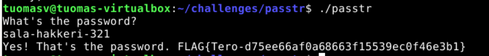

## b)

Avasin lähdekooditiedoston käyttäen nanoa, komennolla 'nano passtr.c'. Sieltä löytyi nopeasti rivi, jossa käyttäjän syöttämää salasanaa verrataan suoraan oikeaan suojaamattomaan salasanaan. En ollut varma, miten lähtisin suorittamaan tehtävän, eikä tehtävänannossa mainittu obfuskaatio ollut täysin tuttu termi. Googlettamalla termi valkeni, ja seuraavaksi lähdin tutkimaan C:llä tehtävästä salaus- ja purkamisalgoritmia Mediumin artikkelista (Konca 2020). En ollut varma kannattiko sitä yrittää toistaa ja löytyisikö tehtävään yksinkertaisempi ratkaisu, joten kysyin ChatGPT-5.6 Luna -tekoälyltä vinkkejä merkkijonojen obfuskointiin. Promptiksi kirjoitin "A source code C file has a line of checking if password is correct, it shows the password as text with no encryption etc. Hints / advice how to simply obfuscate it, so that no one can use string command <filename> to see the password?" Tekoäly kehotti tutkimaan joko XOR-obfuskointia, tai "password hashing" turvallisempana vaihtoehtona.

Koska tehtävässä riitti obfuskointi, googletin "xor obfuscation c". Löysin Learn C Games -ohjelmointiblogin tekstin, josta opin, että XOR "flippaa" tavujen bittejä avainarvon perusteella, ja mitä enemmän tavuja, sitä vaikeampi asiasta on saada alkuperäistä (Bolton n.d.). Katsoin myös esimerkkivideota aiheesta (Birch 2025), jossa näytettiin XOR-salausta käytännössä C-kielellä. Otin tästä mallia ja yritin soveltaa logiikkaa tehtävän kooditiedostosa, mutta tässä esimerkissä tehtiin salaus vain yhdelle merkille eikä merkkijonolle.

Kysyin tekoälyltä apua merkkijonon suojauksesta, ja sain vastaukseksi for-silmukan sekä kertauksen samalla siitä, että C-kielessä merkkijonon viimeinen merkki on aina null, eli "\0".

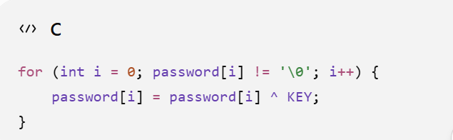

Sovelsin siis tätä logiikkaa koodiini, ja kokeilin tulostaa sen funktiolla printf("Decrypted: ", password). Ohjelmakoodi piti tässä vaiheessa kääntää (compile) uudelleen ajettavaksi tiedostoksi, johon käytin komentoa 'gcc passtr.c -o passtr'. Ajoin ohjelman, mutta tulostuksena tuli vain "Decrypted: ". Jälleen siis ongelma C-kielen kanssa. Kysyin tällä kertaa neuvoa Claude-tekoälyltä, joka kertoi, että lainausmerkkien sisään täytyy laittaa %s, jotta printf-funktio osaa käyttää password-muuttujan tulostuksessa. Lopulta tulostusrivi oli 'printf("Ciphered: %s\n", password);', koska rivinvaihto oli myös hyvä sisällyttää. Tässä vaiheessa passtr.c -tiedosto näytti seuraavanlaiselta:

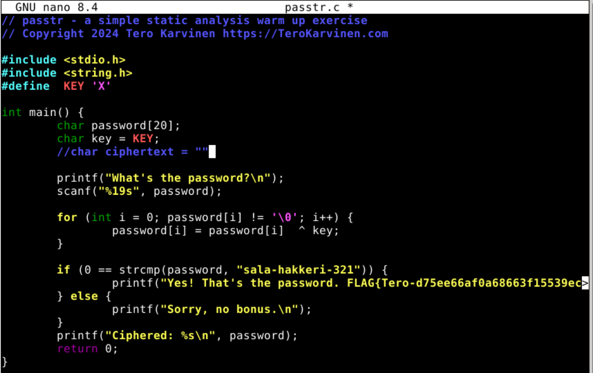

Käänsin ja ajoin ohjelman, ja sain tulostettua xor-salatun salasanan.

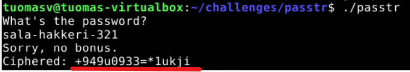

Tallensin tämän tekstin ciphertext -muuttujaan. Laskin manuaalisesti merkkien pituuden, joita oli 16, joten laitoin tyypiksi char[17], koska C-kielessä täytyy varata ylimääräinen merkki null-merkille. Muokkasin salasanan tarkistusta siten, että muutettua salasanaa verrataan tähän. Lopullinen koodi näytti seuraavalta:

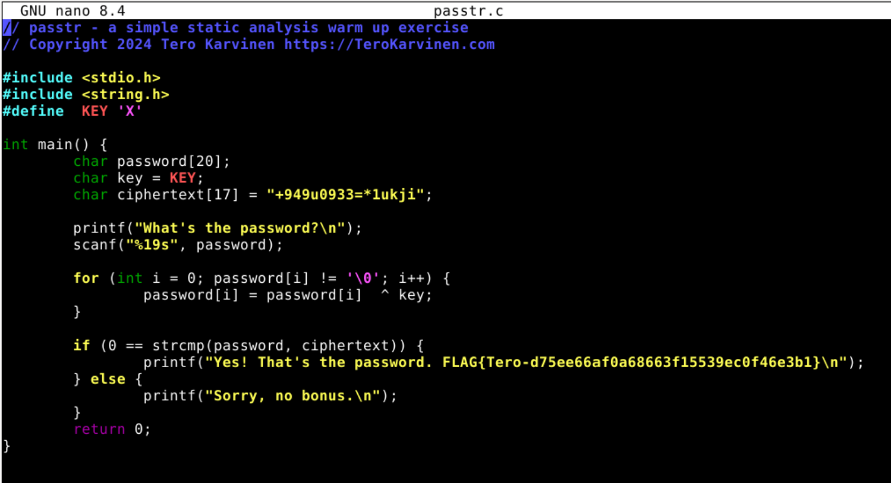

Käänsin ja ajoin ohjelman jälleen, ja syötin salasanan sala-hakkeri-321. Toimi! Suoritin komennon 'strings passtr'. Tällä kertaa valmista salasanaa ei näkynyt, pelkästään suojattu salasana, joka ei sellaisenaan toimi. Lähdekoodista saa toki selville suojausavaimen, eli tämä ei tietenkään ole turvallisin ratkaisu, mutta se riitti tämän tehtävän ratkaisuun.

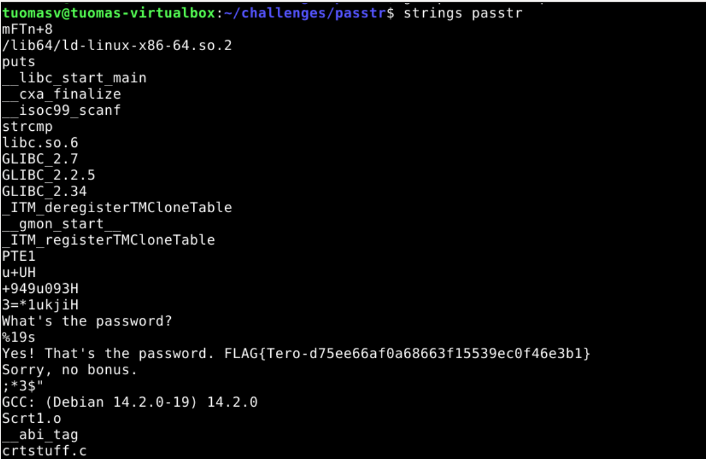

Tehtävä oli haastava ja opettavainen, ja vaikka C-kielen mutkikkuuksien kanssa tuli tapeltua, sekin oli hyödyllistä kokemusta.

## c)

Siirryin kotihakemistostani tehtävän hakemistoon komennolla 'cd challenges/packd', ajoin ohjelman komennolla './packd'. Ohjelma kysyi salasanaa, ja testailin ensin huvikseni muutamaa salasanaa, jotka eivät toimineet. Suoritin komennon 'strings packd' ja katsoin millaisia merkkijonoja se tulostaa. Tällä kertaa tulos oli hieman kryptisempi kuin a-tehtävässä. Flag kuitenkin löytyi, mutta siitä näytti puuttuvan vähintäänkin sulkeva aaltosulku. Kaikki näytti olevan jaoteltu useammalle riville.

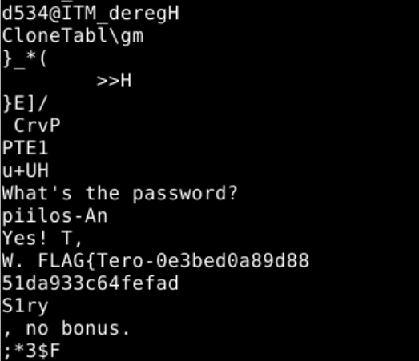

Kokeilin "piilos-An" salasanaa, ei toiminut. Strings-komennon tulosteissa oli linkki upx:n sivuille, joten klikkasin sitä, mutta en löytänyt vielä mitään mikä olisi antanut vihiä salasanasta. Kokeilin kuitenkin salasanaksi "upx", mutta sekään ei toiminut.

Pohdin uudelleen "piilos-An" -tekstin merkitystä, ja kokeilin salasanoiksi tästä erilaisia variaatioita, menestyksettä. Palasin tutkimaan strings-komennon tulostetta löytääkseni sieltä jotain suuntaa-antavaa. En alkanut kokeilemaan listan lukuisia satunnaisen näköisiä merkkijonoja salasanasyötteesen, koska oletin, ettei se ole tehtävän tarkoitus. Yritin kuitenkin vielä turhaan lisää upx:ään liittyviä sanoja ja yhdistelmiä, kuten "upx executable packer".

Pohdin, että upx:n sivuille vievä linkki on luultavasti kuitenkin oleellinen. Painoin "Download latest release" nappia, joka vei minut Githubiin. Vasta tässä vaiheessa minulla klikkasi; UPX on pakkaustyökalu, jolla packd on pakattu, joten ehkä minun kuuluisi purkaa se käyttäen tätä työkalua. Halusin asentaa työkalun terminaalista, ja tein sen komennolla 'sudo apg-get upx'. Sitten suoritin komennon upx -h, jotta näkisin, mitä voin tehdä työkalulla. Silmääni osui decompress-komento.

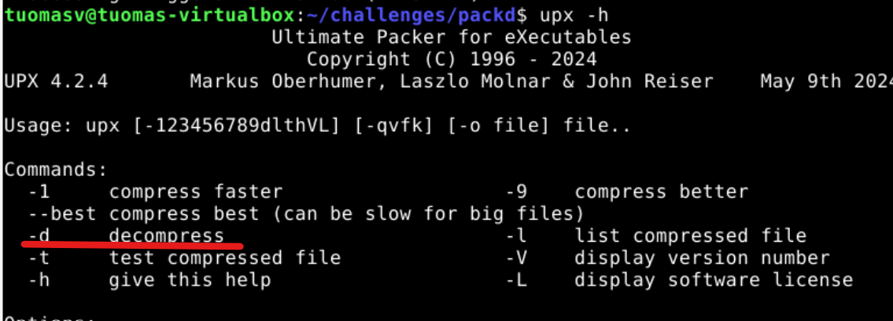

Kokeilin siis suorittaa komennon 'upx -d packd". Onnistui!

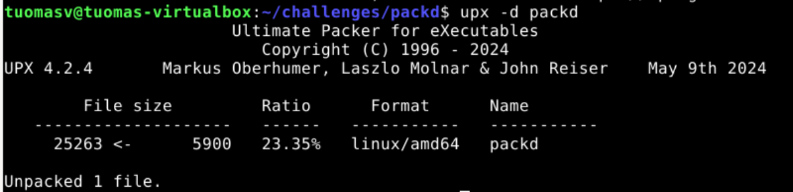

Suoritin komennon 'strings packd', totuuden hetki:

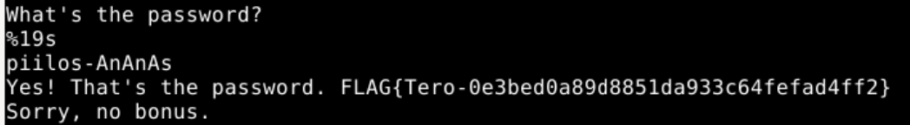

Nyt salasana näytti kokonaiselta, ja flag myös! Kokeilin salasanaa, ja se oli oikea.

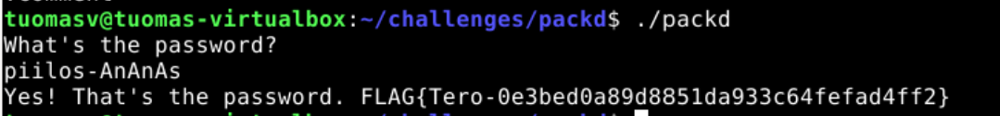

Tehtävän ratkaisu tuntui todella tyydyttävältä, vaikka jälkeenpäin tuli typerä olo siitä, että käytin suhteellisen pitkän ajan mahdollisten salasanojen ja vihjeiden etsimiseen ja kokeiluun ennen kuin tajusin mitä täytyy tehdä. Strings-komennon tuloste kuitenkin palautti selkeästi erinäköisiä rivejä kuin aiemmassa tehtävässä, tekstiriveistä ja flagista puuttui osia, ja tiedoston kerrottiinkin olevan pakattu. Ainakin tiedän nyt paremmin mitä tehdä, jos vastaavanlaisia haasteita tulee myöhemmin vastaan.

# Lähteet

Birch, J. 2025. Xor encryption in C programming. YouTube. Katsottavissa: https://www.youtube.com/watch?v=kslkAX6frFE. Katsottu 7.9.2026.

Bolton, D. n.d. How to do XOR encryption in C. Learn C Games Programming Blog. Luettavissa: https://learncgames.com/tutorials/how-to-do-xor-encryption-in-c/. Luettu 7.9.2026.

Chat GPT 5.6 Luna. OpenAI.

Konca, M. 2020. Encryption and Decryption Algorithm in C. Medium. Luettavissa: https://mustafaserdarkonca.medium.com/encryption-and-decryption-algorithm-in-c-26c18080cbd7. Luettu 7.9.2026.
