# H4 otsikko

## Ympäristö

- Virtuaalikone: Debian 13 64bit, Oracle VirtualBox
  - RAM-muisti: 4000 MB
  - Prosessoreita: 2
  - Näytönohjain: VMSVGA, videomuisti 16 MB
  - Levy: 60 GB (SATA), asennus-ISO debian-live-13.6.0-amd64-xfce
  - Selain: Firefox 140.12.0 (64-bit)
  - Verkkoasetus: NAT
- Isäntäkone: Lenovo ThinkPad T470p
  - Prosessori: Intel(R) Core(TM) i7-7600HQ CPU @ 2.80GHz
  - RAM: 32GB
  - Käyttöjärjestelmä: Windows 11 Pro

## x)

- Ghidra on ohjelmien käänteismallinnukseen (reverse engineering) tarkoitettu työkalu, joka näyttää ohjelman binäärin Assembly-kielellä, ja käänteismallintaa konekielen C-koodiksi.

- Yksi hyödyllinen työkalu Ghidrassa on Defined Strings, jonka löytää Window-valikosta. Sieltä löytää ohjelman merkkijonot ja näitä kohtia vastaavat kohdat konekielellä.

- Klikkaamalla funktioita decompile-ikkunassa (funktiot merkitty tyylillä FUN_012345) voi avata niiden määritelmän.

- Funktioita ja muuttujia voi nimetä uudelleen pikanäppäimellä L, tai klikkaamalla niiden kohdalla hiiren oikeaanäppäintä, ja valitsemalla "Rename Function"

- Näkymissä voi liikkua takaisin esm painamalla vasemmalle osoittavaa nuolta GUI:n ylävasemmalla, ta painamalla Alt + Vasen nuoli.

- Videon esimerkissä lipun saamiseen tarvittava numero löytyi hexadesimaali-muodossa decompile-näkymästä if-lausekkeesta, if(local_48 == 0x86178), ja se muutettiin kokonaisluvuksi pythonilla.

## a) Ghidran asennus

Latasin Ghidra 12.1.3:n osoittesta https://github.com/NationalSecurityAgency/ghidra/releases. Avasin terminaalin, siirryin Downloads kansioon ja purin ladatun paketin komennolla `unzip ghidra_12.1.3_PUBLIC`. Purku palautti kansion, nimesin sen yksinkertaisemmaksi komennolla `mv ghidra_12.1.3_PUBLIC ghidra` ja siirsin kansion kotihakemistooni komennolla `mv ghidra ..`. Sirryin tähän hakemistoon komennolla `cd ../ghidra`.

## b) Rever-C

Latasin ezbin-kansion, purin sen uuteen tekemääni hakemistoon komennolla `unzip Downloads/ezbin-challenges.zip -d h4/ezbin `.

Kokeilin suorittaa ghidran komennolla ./ghidraRun. Tuloksena oli seuraava virheviesti Javan puuttumisesta.

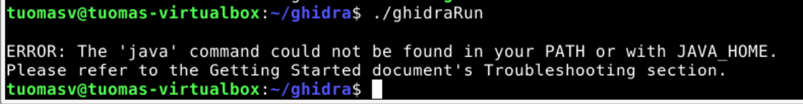

Asensin JDK versio 21:n `sudo apt install openjdk-21-jdk`. Tämän jälkeen `./ghidraRun` -komento toimi, ja Ghidra käynnistyi.

Loin Ghidrassa uuden projektin, ja annoin sille nimeksi ezbin-01. Painoin pikanäppäintä `I`, jolla sai tuotua tiedoston. Muistin kuitenkin tässä vaiheessa, että jos ezbin on täysin sama hakemisto kuin h3-tehtävissä, packd pitäisi purkaa ensin. Tein sen siirtymällä terminaalissa hakemistoon, jossa tiedosto oli, ja suoritin komennon `upx -d packd`. Nyt tiedosto oli purettu. Toin tämän tiedoston Ghidra-projektiin.

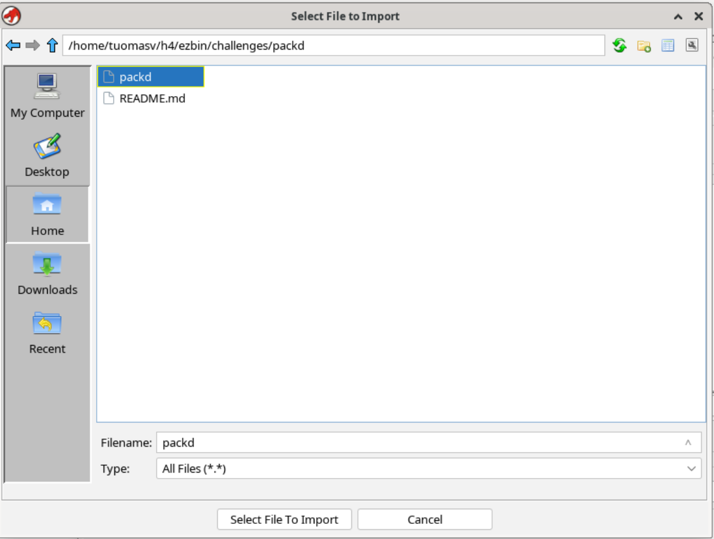

Ghidra tunnisti tiedoston 64-bittiseksi linux-binääriksi.

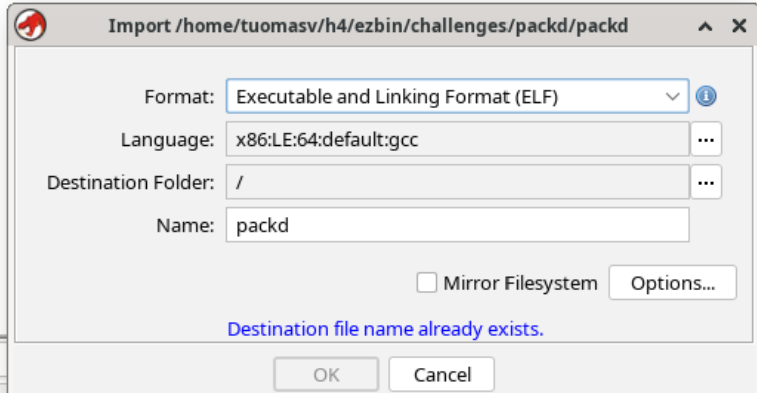

Tuplaklikkasin tiedoston nimeä.

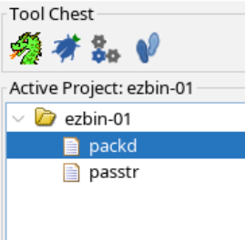

Vaihtoehtoinen tapa siirtyä Code Browseriin olisi ollut klikata Lohikäärme-kuvaketta ja tuoda tiedosto vasta sitten.

Valitsin oletusasetukset binäärin analysontiin. Nyt listing-näkymässä näkyi Assembly-koodia.

Ensimmäisessä tehtävässä katsotun videon esimerkin kaltaisesti avasin Defined Strings -ikkunan painamalla Window -> Defined Strings. Muistin, että ohjelma kysyy käyttäjän salasanaa, joten asetin filtteriksi "password". Tuplaklikkasin löytynyttä merkkijonoa.

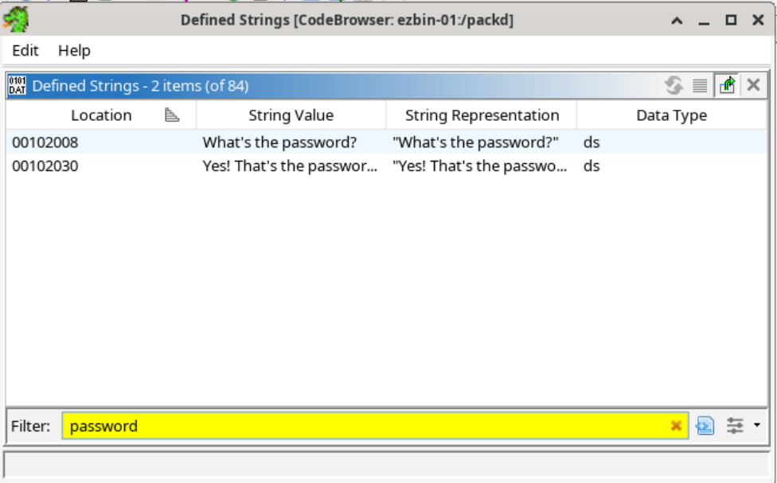

Nyt Listing-näkymässä näkyi jo salasana, muttei koko lippua.

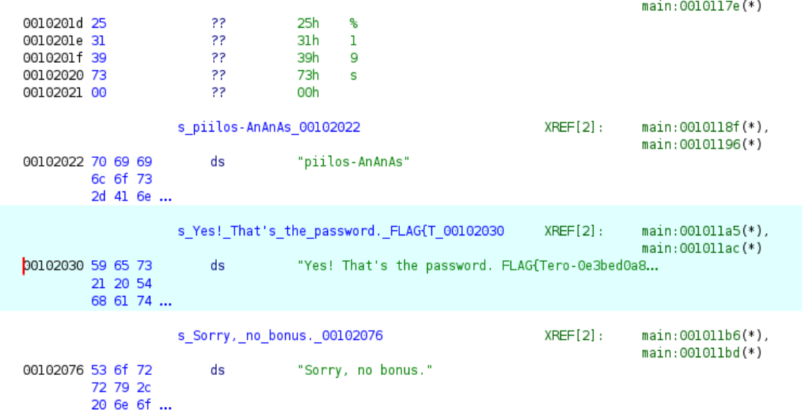

Tuplaklikkasin oikealla näkyvää main-funktiota. Decompileriin ilmestyi nyt käänteismallinnettua C-koodia, jossa näkyi sekä salasana että lippu.

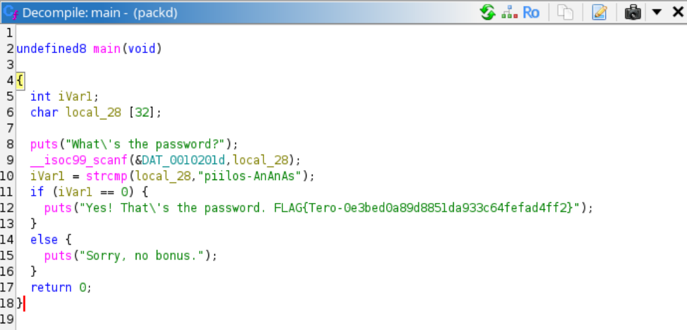

Annoin x -muuttujalle nimeksi password, klikkaamalla tätä hiiren oikealla ja valitsemalla "Rename variable". Tein samalla tavalla uudelleennimeämiset iVArl-muuttujalle sekä printtaus- sekä syötefunktille. En ollut varma pitikö DAT-0010201d myös nimetä uudelleen. Tiesin, että se kohta kertoo scanf-funktiolle, kuinka pitkän merkkijonon verran muistia se varaa, mutten löytänyt tietoa siitä, kuinka pitkä tämän merkkijonon tuli olla. Jätin tämän siis sellaiseksi kuin oli.

Main-funktion palautustyyppi oli undefined8. Muutin tämän painamalla hiiren oikeaa, ja valitsemalla "Retype Return". Syötin kenttään "int". Tämän alle ilmestyi useita vaihtoehtoja, joista valitsin vain ensimmäisen, koska se vaikutti sopivalta, enkä ollut varma oliko tällä kuinka ratkaiseva merkitys.

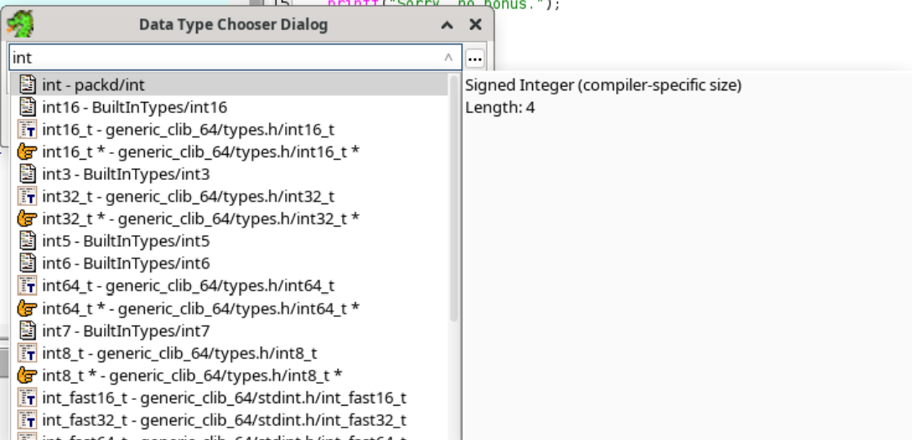

Lopulta koodi siis näytti tältä:

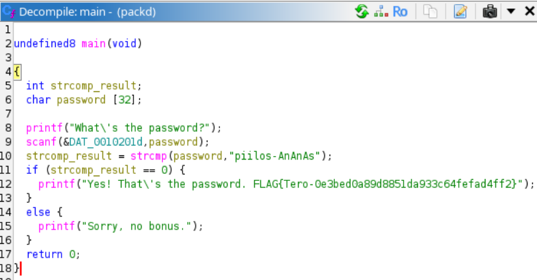

Ohjelman toimintajärjestys oli siis seuraava: Julistetaan muuttujat int strcomp-result, sekä char password [32] (tämä on 32 merkkiä pitkä taulukko, eli käytännössä merkkijono). Ohjelma kysyy käyttäjältä salasanaa printf-funktiolla, ja avaa syöteskannerin scanf-funktiolla. Käyttäjän syöttämää merkkijonoa verrataan oikeaan salasanaan strcmp-funktiolla, ja jos tämä palauttaa 0, se tarkoittaa että merkkijonot eivät eroa toisistaan eli syöte osui oikeaan. Ohjelma tulostaa vahvistusviestin sekä lipun. Jos strcmp-funktion tulos on mikä tahansa muu, niin ohjelma tulostaa viestin, että salasana oli väärä. Main-funktio päättyy palauttamalla arvon 0.

## c) If backwards

Tällä kertaa en avannut Defined Strings-ikkunaa, vaan klikkasin käyttöliittymän vasemmasta osasta Symbol Treestä Functions-kansion auki, ja valitsin täältä main-funktion. Sitä klikkaamalla Decompileriin ilmestyi käänteismallinnettu C-koodi.

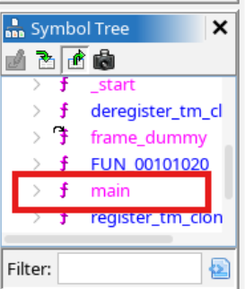

Mietin, että jotta ohjelma hyväksyisi minkä tahansa salasanan paitsi sala-hakkeri-321, ohjelmasta pitäisi vain vaihtaa operaattori `==` operaattoriksi `!=` rivillä 11, kun tarkastetaan strcmp-funktion tulos. Decompile-näkymässä ei voinut muokata koodia kuin koodieditorissa, enkä tiennyt kuinka binääriä voi muokata Ghidralla. Maalasin yhtäsuuri-kuin -operaattorin, ja Listingissä näkyi sitä vastaava rivi. Sama rivi näkyi vihreällä, kun maalasin koodista hieman isomman osan, '(iVarl == )'

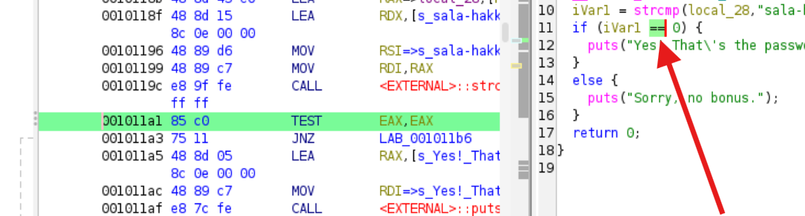

Ymmärtääkseni paremmin Assemblykoodia tässä kontekstissa, kysyin apua tekoälyltä. En rehellisesti ymmärtänyt vastauksesta valtaosaa, mutta se avainasia jonka opin, oli että JNZ tarkoittaa "Jump if not Zero, jolloin ohjelma hyppää else-haaraan. JZ puolestaan tarkoittaa "Jump if Zero". (ChatGPT 5.6 Luna). Päättelin, että kokeilisin muuttaa JNZ:N JZ:ksi.

Seurasin ohjelmoijabloggaaja Shravan Jambukesanin (2020) tutoriaalivideon askelia binäärin muokkaamisessa. Painoin JNZ:n kohdalla hiiren oikeaa, ja valitsin Patch Instruction.

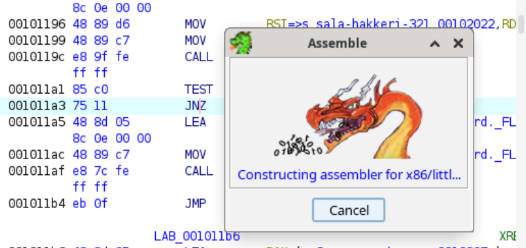

Ohjelma myös ilmoitti, että prosessorini sai kultaluokituksen, sehän kelpaa.

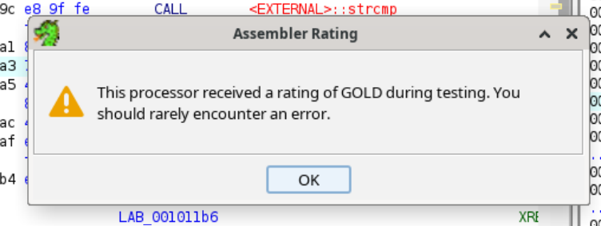

Vaihdoin JNZ -> JZ.

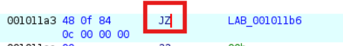

Tallensin projektin ja painoin File -> Export Program. Formaattivaihtoehdoissa ei ollut "Binary", kuten katsomallani ohjevideolla, joten kokeilin valita Original File.

Kun vienti (export) oli valmis, siirryin hakemistoon, jonne uusi tiedosto talletettiin. Tälle piti vielä asettaa ajo-oikeudet komennolla `chmod +x passtr`. Ajoin tiedoston, ja "sala-hakkeri-321" ei enää kelvannut salasanaksi, mutta mikä tahansa muu syöte aiheutti virheen "Segmentation Fault".

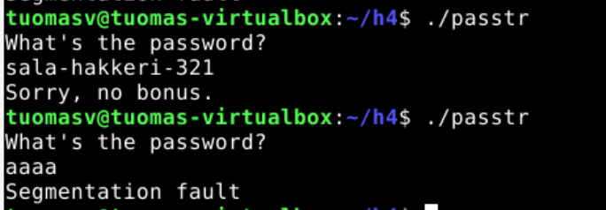

Jätin tehtävän tällä kertaa tähän, koska ajankäytön takia minun täytyi siirtyä eteenpäin. Ratkaisin siis vain osan tästä tehtävästä. Kenties "yhtä suuri kuin" -operaattoria olisikin pystynyt muokkaamaan binäärissä, mutta se jäi nyt osaltani myöhemmin opittavaksi.

Käytetyt promptit tekoälylle:

- Whats the == operator in assembly in the left view? Screenshot is from Ghidra tool.How would I change that operator in the binary?

## d) Nora CrackMe

Latasin tiedostot crackme01.c, crackme01e.c ja crackme02.c Githubista. Siirsin nämä terminaalissa Downloads-kansiosta eri hakemistoon tyylillä `mv Downloads/<tiedostonimi> <uusihakemisto/>`. Käänsin tiedostot binääriksi (ja nimesin) komennolla `gcc <tiedostonimi.c> -o <tiedostonimi>`.

## e) crackme01

Testasin ohjelman ajon komennolla ./crackme01. Ohjelma tulosti "Need exactly one argument.".

Tein Ghidrassa uuden projektin, avasin CodeBrowserin ja toin crackme01 -tiedoston. Avasin main-funktion näkyviin Symbol Treen kautta kuten c-tehtävässä.

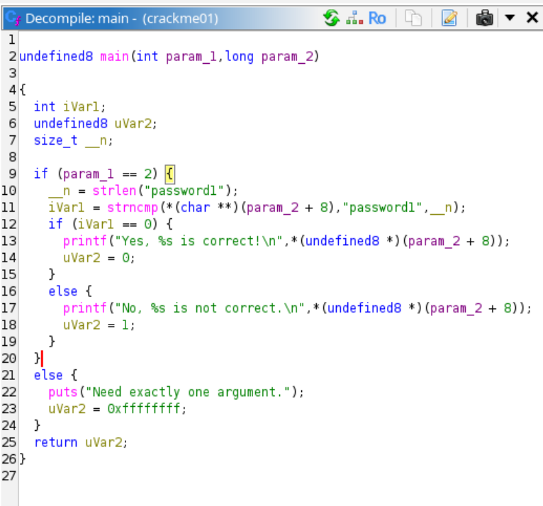

Ensin tulkitsin, että main odottaa saavansa käyttäjältä kaksi argumenttia, ja että ensimmäisen parametrin täytyy olla kokonaisluku 2. Sitten luin kuitenkin lisää C-kielestä, ja opin kuitenkin että lähdekoodissa main-funktion ensimmäinen argumentti tarkoittaa aina argumenttien määrää eikä käyttäjän syöttämää määrää (GeeksforGeeks 2026).

Tulkitsin käänteismallinnetusta koodista, että \_\_n -nimiseen muuttujaan tallennetaan password1 -merkkijonon pituus eli 9. En ensin ymmärtänyt, miksi strncmp-funktio saa 3 argumenttia, mutta opin Googlettamisen jälkeen TutorialGatewayn sivuita, että kolmas argumentti kertoo, kuinka pitkiä argumenteiksi annetut merkkijonot ovat. Ja tämä olikin strncmp-funktio, eikä strcmp kuten aiemmissa tehtävissä.

En tiennyt mitä char\*\* tarkoitti, mutta tiesin sen vain liittyvän jollain tavalla pointtereihin. Joka tapauksessa param_2+8 pitäisi olla yhtä kuin "password1", jotta argumentit ovat oikein. Käytin jonkin aikaa tämän asian tutkimiseen, että pitääkö password-sanasta jotenkin vähentää 8 (ehkä ASCII-taulukkoa hyödyntäen), ja siten saisi oikean ratkaisun. Opin kuitenkin tekoälyltä (ChatGPT), että +8 password muuttujan vieressä tarkoittaa, että ohjelma käyttää muistia 8 tavua param_2-muuttujaan tallennetun osoitteen jälkeen. Kokeilin vain ajaa ohjelman terminaalissa ja antaa argumentiksi "password1". Sehän se ratkaisu vain olikin.

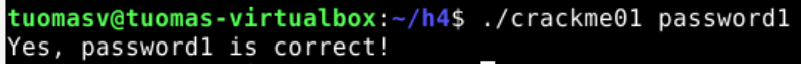

## e) crackme01e

Kun kokeilin ajaa crackme01e -ohjelman, sekin palautti "Need exactly one argument.". Kokeilin salasanaksi password1, ja ohjelma palautti "No, password1 is not correct".

Vein tiedoston Ghidraan ja avasin käänteismallinnetun main-funktion.

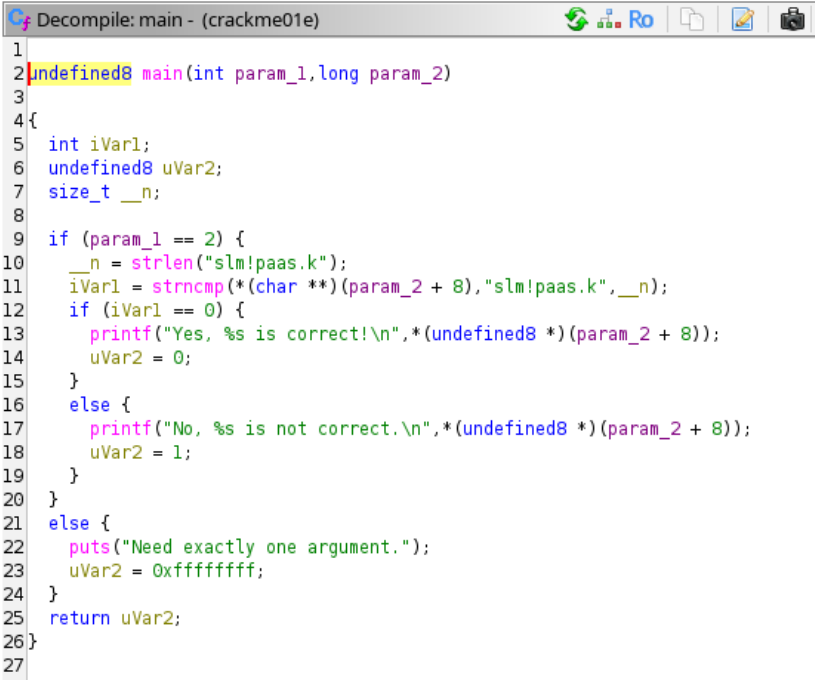

Kokeilin salasanaksi koodissa näkyvää slm!paas.ko, ja ohjelma palautti seuraavan tulosteen.

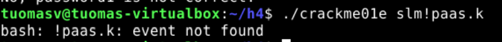

Ilmeisesti erikoismerkit pilasivat syötteen, ja bash pitää huutomerkin jälkeistä merkkijonoa jonkinlaisena eventinä. Muutaman kokeilun kautta huomasin, että jos argumentin päättää huutomerkkiin, se ei haittaa, mutta jos huutomerkin jälkeen lisää merkkejä, tulee sama bash: \_\_ event not found -viesti. Kysyin tekoälyltä, kuinka laitan huutomerkin argumentin keskelle, ja ratkaisu oli laittaa argumentti heittomerkkien sisään. Tästä tuli hieman typerä olo, kun en ajatellut kokeilla sitä itse.

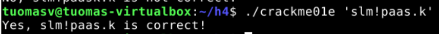

AI:lle annettu prompti:

- How do I add an exclamation mark in the middle of a c programs argument in terminal?

## f) crackme02

Käänteismallinnettu ohjelma näytti hieman monimutkaisemmalta kuin aiemmat.

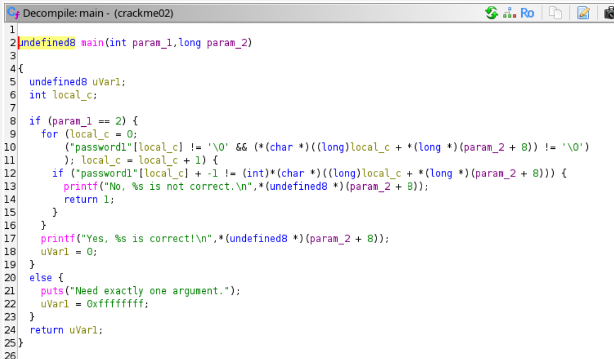

Nimesin muuttujia kuvaavimmiksi.

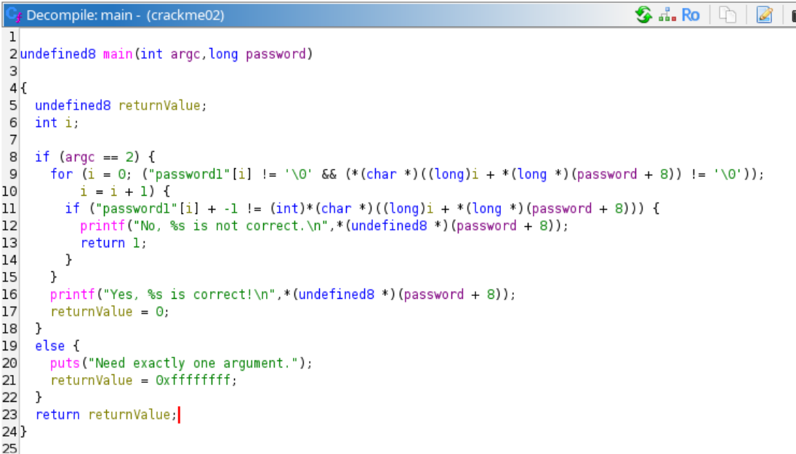

Ohjelmassa on for-silmukka, jossa käytetään muuttuja i:tä eli indeksiä, jolle annetaan alkuarvoksi 0. Jatkamisehtoja on kaksi, joista ensimmäinen on se, että silmukka pyörii niin kauan kuin "password1"-merkkijonossa on merkkejä, eli 9 kertaa. Nämä käydään yksitellen läpi indeksin i-avulla. Toista jatkamisehtoa en täysin ymmärtänyt. Se kuitenkin näytti siltä, että, i + password ei saa olla null. Ehkä se varmistaa, ettei ohjelma koske password-muuttujalle varatun muistin ulkopuolelle? Eli käytännössä sama asia kuin "password"-merkkijononkin kohdalla.

Silmukan sisällä tarkastetaan käsittääkseni, onko "password1"-merkkijonon tietty merkki, johon lisätään -1 (eli vähennetään 1), yhtä suuri kuin i lisättynä käyttäjän syöttämä salasana plus 8. En voi sanoa ymmärtäneeni varsinkaan tätä jälkimmäistä vertailukohdetta, mutta jotenkin tässä tarkistetaan, täsmäävätkö oikean salasanan ja käyttäjän syöttämän salasanan merkit. Jos nämä eivät täsmää, ohjelmaa kertoo tämä tulostuksella ja lopettaa suorituksen palauttamalla 1. Jos ne täsmäävät, i:n arvoa kasvatetaan yhdellä ja silmukan uusi kierros alkaa. Jos koko silmukka suoritetaan läpi ilman keskeytyksiä, viesti onnistuneesta salasyötteestä tulostetaan. Jos argumentti puuttuu kokonaan, ohjelma kertoo tämän käyttäjälle.

Koska silmukassa vertailtiin käsitykseni mukaan "password1":n merkkejä, joista on vähennetty 1, päätin kokeilla salasanaksi kirjoittaa password1, mutta siten, jokainen merkki yhden alempana ASCII-taulukon järjestyksessä. Logiikka oli siis se, että p muuttui o:ksi, ja 1 nollaksi, ja niin poispäin. Syöte oli siis nyt o`rrvnqc0.

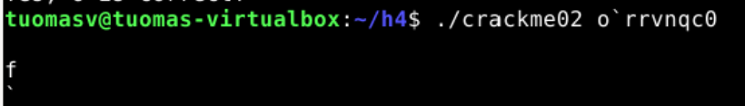

Koska argumentissa oli heittomerkki, syöteskanneri ei sulkeutunut ennen kuin lisäsin sulkevan heittomerkin. Enteria painettuani yllätyin:

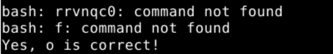

Bash tulkitsi heittomerkin jälkeisen osan yritykseksi suorittaa jonkin komennon, mutta sitä edeltävä "o" kelpasi salasanaksi!

Kokeilin kuitenkin vielä laittaa heittomerkit salasanan ympärille, kuten e-tehtävässä. Sekin toimi! Oletin, että tämä oli varsinainen ratkaisu, mutta jostain syystä pelkkä o:kin toimi. Tämä oli mielenkiintoinen seikka, mutten ehtinyt selvittää tähän syytä.

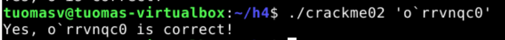
  

# Lähteet

ASCII Code s.a. ASCII Code. Luettavissa: https://www.ascii-code.com/. Luettu: 15.9.2026.

ChatGPT 5.6 Luna. OpenAI.

GeeksforGeeks 2026. C strcmp(). Luettavissa: https://www.geeksforgeeks.org/c/strcmp-in-c/. Luettu: 15.9.2026.

JHammond, J. 2022. GHIDRA for Reverse Engineering (PicoCTF 2022 #42 'bbbloat'). YouTube-video. katsottavissa: https://www.youtube.com/watch?v=oTD_ki86c9I. Katsottu 15.9.2026.

Jambukesan, J. 2020. Getting Started with Ghidra: Basic Binary Patching with String Modification. YouTube-video. Katsottavissa: https://www.youtube.com/watch?v=oTD_ki86c9I. Katsottu: 15.9.2026.

Tutorial Gateway s.a. strncmp in C language. Luettavissa: https://www.tutorialgateway.org/strncmp-in-c-language/. Luettu: 15.9.2026.
